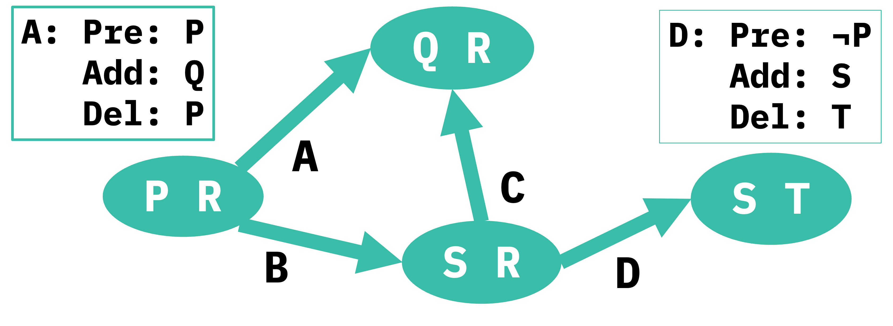
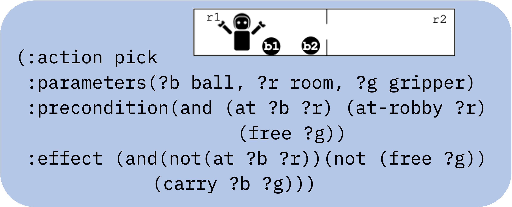
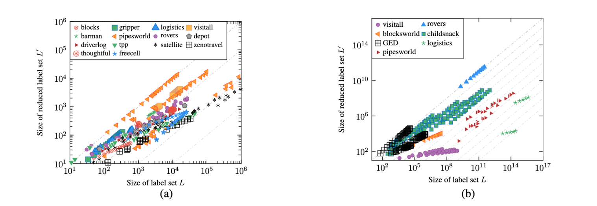
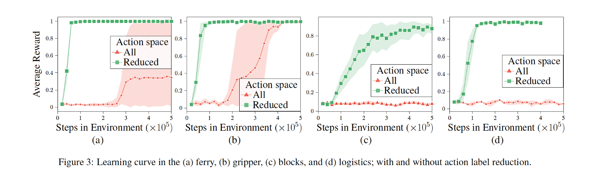
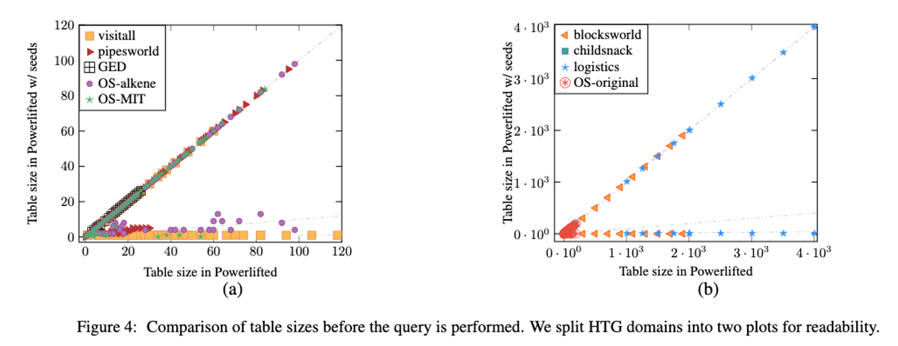

Planning tasks succinctly represent labeled transition systems, with each ground action corresponding to a label. This granularity, however, is not necessary for solving planning tasks and can be harmful, especially for model-free methods. In order to apply such mode methods, the label sets are often manually reduced. In this work, we propose automating this manual process. We characterize a **valid label reduction** for classical planning tasks and propose an automated way of obtaining such valid reductions by leveraging *lifted mutex groups* ([Fišer 2020](https://ojs.aaai.org/index.php/AAAI/article/view/6536)). Our experiments show a significant reduction in the action label space size across a wide collection of planning domains. We demonstrate the benefit of our automated label reduction in two separate use cases:  
1. improved sample complexity of model-free reinforcement learning algorithms 
2. speeding up successor generation in lifted planning.

## Motivation 

Planning tasks, as labeled transition systems, use a unique label for each ground action. 
However, such a labeling strategy generates a huge action space; which is especially unfitting for model-free approaches. For instance, all IPC domain problems have action space ranging from $$10^2$$ to $$10^5$$. While, the domains in Atari benchmark, which is used extensively in Reinforcement Learning, have at most $$18$$ actions.  It is no coincidence that discrete action sets of small sizes are favored by reinforcement learning (RL) approaches. Choosing from a large collection of mostly irrelevant actions
in a state can be detrimental to model-free methods ([Huang and Ontañón, 2022](https://doi.org/10.32473/flairs.v35i.130584)). When planning problems are cast as Markov Decision Processes (MDPs), great care is taken in defining small action spaces manually ([Silver and Chitnis, 2020](https://arxiv.org/abs/2002.06432); [Fern et al., 2006](https://doi.org/10.1613/jair.1700);
[Dzeroski et al., 2001](https://doi.org/10.1023/A:1007694015589)). In this work, we propose automating this manual process, exploring ways of automatically reducing action labels in classical planning domains.

## Main Idea

The key insight that we use in our work is that the main role of the action label is to distinguish two transitions in a given state. Thinking in terms of a labeled transition system, it is easy to see that the action labels need to uniquely identify outgoing edges from each state. For example, in the LTS shown below, two edges from node $$\langle \texttt{P,R} \rangle$$ should not have the same label. We believe that this granularity of assigning unique labels is not essential. Rather we can assign the same labels to two different ground actions and obtain a smaller action space. Consider the precondition of actions $$\texttt{A}$$ & $$\texttt{D}$$ in the above LTS. Since the preconditions of action $$\texttt{A}$$ & $$\texttt{B}$$ are mutually exclusive, these actions can never be applied in the same state. So can we not use the same label for it? 

  

  

Consider a separate example of a gripper domain shown below. Here, we have a robot with two grippers ($$\texttt{g1}$$ and $$\texttt{g2}$$) in a two room ($$\texttt{r1}$$ and $$\texttt{r2}$$) environment with two balls ($$\texttt{b1}$$ and $$\texttt{b2}$$). In this domain, the lifted action model $$\texttt{pick}$$ has 3 parameters $$\texttt{?b}$$ for the ball to be picked, $$\texttt{?r}$$ for the room where the ball currently lies, and $$\texttt{?g}$$ indicating the gripper which should pick the ball. Assigning a unique label to each ground action generated by this lifted action model would effectuate $$\mid \texttt{balls}\mid \times \mid \texttt{rooms}\mid \times \mid \texttt{grippers}\mid $$ actions. 

<!-- Over all, the size of action space would be $$\approx \mid parameters\mid^{\mid objects\mid}$$. -->
  

  

However, we know actions $$\texttt{(pick b1 r1 g1)}$$ and $$\texttt{(pick b1 r2 g1)}$$ are mutually exclusive, because of the mutually exclusive preconditions $$\texttt{(at b1 r1)}$$ and $$\texttt{(at b1 r2)}$$ respectively. So, we can use the same label for both these actions, say $$\texttt{(pick b1 g1)}$$. Similarly, action $$\texttt{(pick b2 r1 g1)}$$ and $$\texttt{(pick b2 r2 g1)}$$ can be labeled $$\texttt{(pick b2 g1)}$$. Essentially, we use only two parameters $$\texttt{?b}$$ and $$\texttt{?g}$$ of the $$\texttt{pick}$$ action model to generate the labels. 

**Some parameters help distinguish applicable action, some do not. The ones that do are called parameter seeds. Identification of parameter seeds can provide valid label reduction.** We defer to the main paper for details on how we obtain the reduction. Next, we present the significance of our approach and demonstrate two use cases. 

> Our work characterizes a *valid label reduction* for classical planning tasks and propose an automated way of obtaining such valid reductions by leveraging *lifted mutex groups*.

## Results

Using our parameter seed set approach to label reduction, results in a **significant reduction of the action space**. Figure a (on the left below), presents the reduction on each PDDL problem instance for $$14$$ IPC domains and Figure b (on the right) on $$7$$ Hard-To-Ground domains. Both axes are log-scaled. Points below the diagonal indicate instances where the reduced label set is smaller than the original one. The distance from the diagonal indicates the significance of the reduction. Gray dashed lines below the diagonal represent the order of magnitude of the reduction. We see a substantial reduction; going up to $$2$$ orders of magnitude on IPC problems and up to $$10$$ orders of magnitude on hard-to-ground domains

### Usecase 1. Learning RL policies

For our first use case, we study the impact of action space reduction on learning RL policies. The figure below represents the learning curve of RL agents in 4 classical planning tasks, (a) Ferry () Gripper, (c) Blocks, and (d) Logistics.  The green lines represent the learning curve of RL agents in a reduced action space, when comparing this with the red curve of RL agents with default action space (using a unique label for each grounded action) we see a **significant advantage in sample efficiency**. 

### Usecase 2. Lifted Successor Generator

In a lifted successor generator, like Powerlifted ([Corrêa et al. 2021](https://ojs.aaai.org/index.php/ICAPS/article/view/15951)), the task of querying applicable action is posed as a database query. The complexity of executing that query is a function of table size. With our approach of identifying parameter seeds, we can reduce the table sizes significantly; hence improving the query complexity and processing time. The figure below presents a comparison of the table sizes for the initial state in $$10$$ IPC domain problems.

## Conclusion 

In this work, we have introduced definitions of a valid label reduction and applicable action mutex groups and have shown the connection between the two. We have presented a method for automatically deriving action label reductions for planning tasks based on action parameter reduction. For that, a parameter seed set problem was introduced, and a solution to the problem was suggested by translating it to delete-free planning. Our experimental evaluation shows a significant reduction in action labels when using our approach, across all tested planning domains. This reduction translates both into improved sample efficiency of standard RL agents and into reduced computation time of identifying applicable ground actions in lifted planning, the two example use cases.

## Citation

If you build on this code or the ideas of this paper, please use the following citation.

    @inproceedings{KokelLKSS23,
         title={Action Space Reduction for Planning Domains},
         journal={IJCAI},
         author={Kokel, Harsha and Lee, Junkyu and Katz, Michael and Srinivas, Kavitha and Sohrabi, Shirin},
         year={2023}
    }

## Code 

The code for identifying parameter seed sets is available [here](https://github.com/IBM/Parameter-Seed-Set).<a href="#footnote2">*</a> Additionally, the code to use the parameter seeds in Powerlifted, a lifted successor generator, is available [here](https://github.com/IBM/Powerlifted-PSS).<a href="#footnote3">#</a>

<footer class="site-footer">

<a id="footnote2">*</a> This code is licensed under the <a href="../LICENSE">Eclipse Public License, Version 1.0 (EPL-1.0)</a>.   

 

<a id="footnote3">#</a> This code is licensed under the <a href="https://github.com/IBM/Powerlifted-PSS/blob/main/LICENSE">GNU GENERAL PUBLIC LICENSE Version 3 (GPL v 3.0)</a>

</footer>